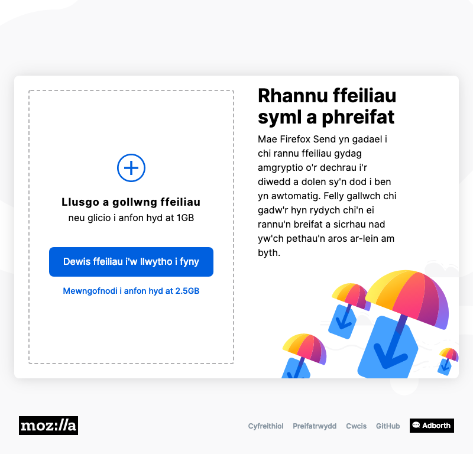
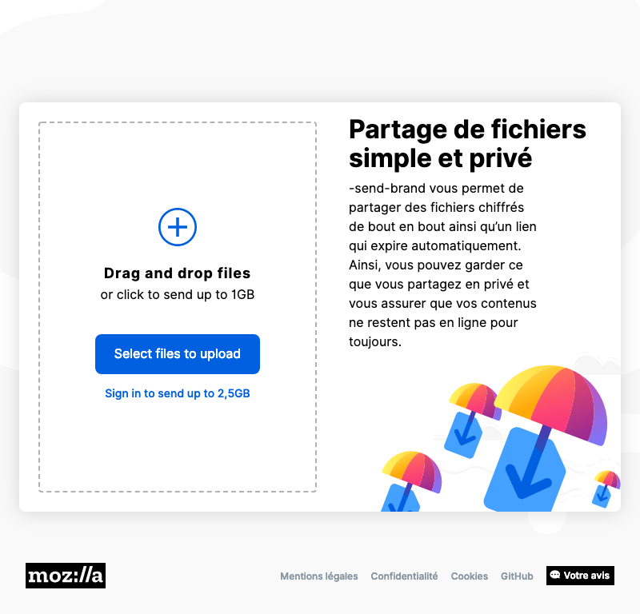
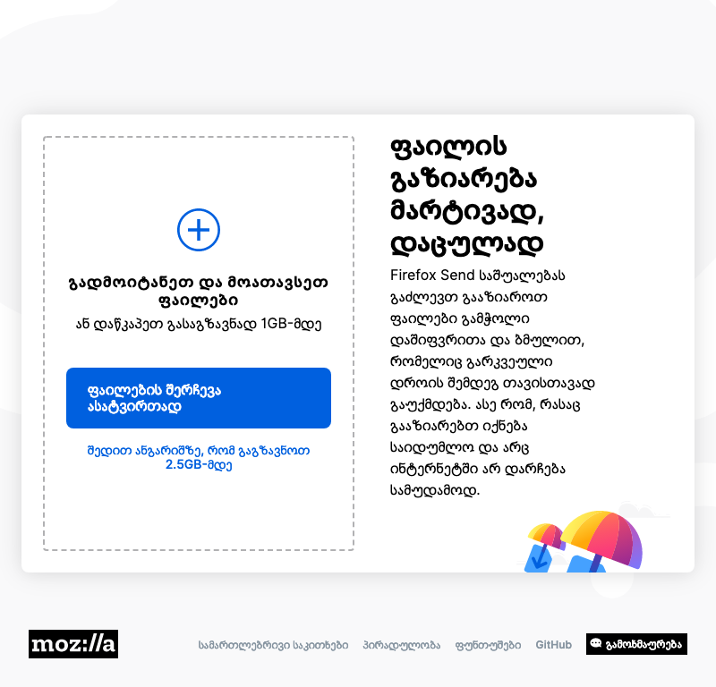
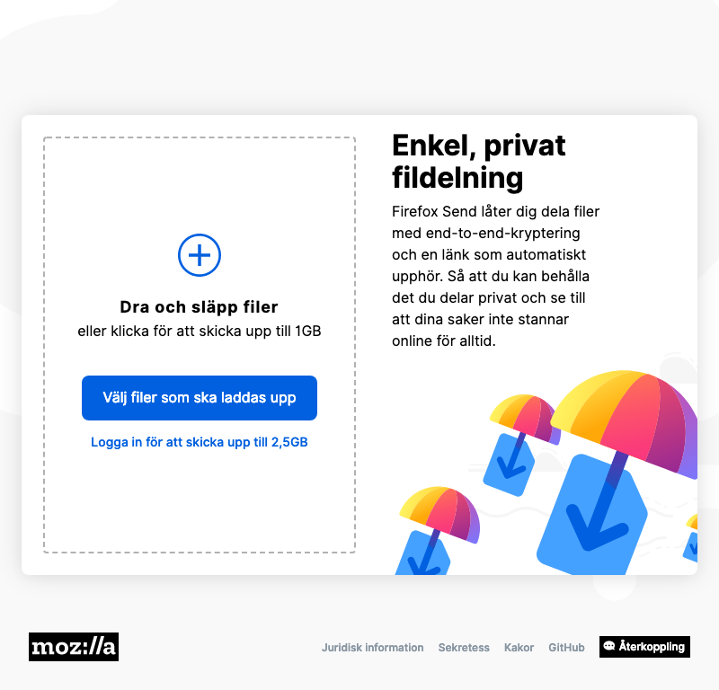
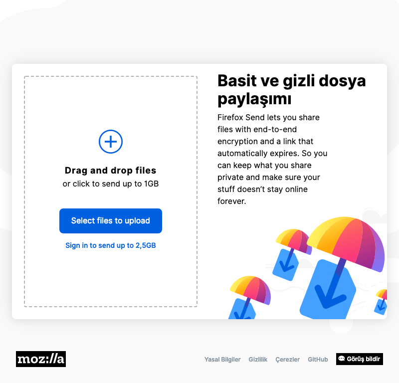
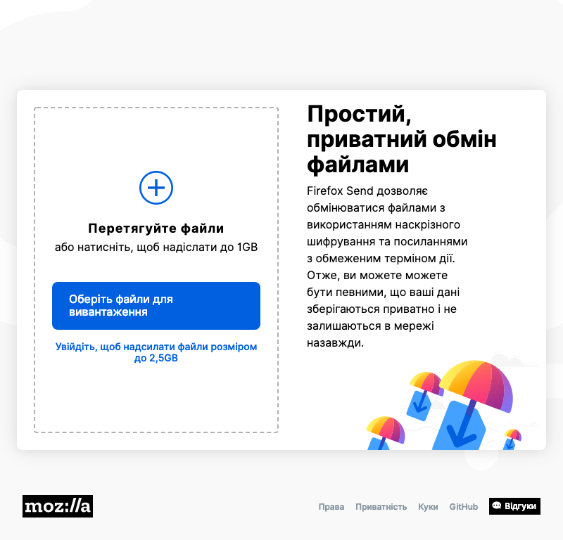
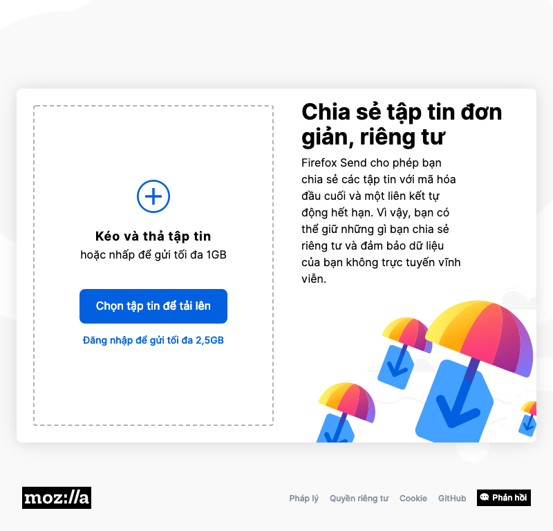
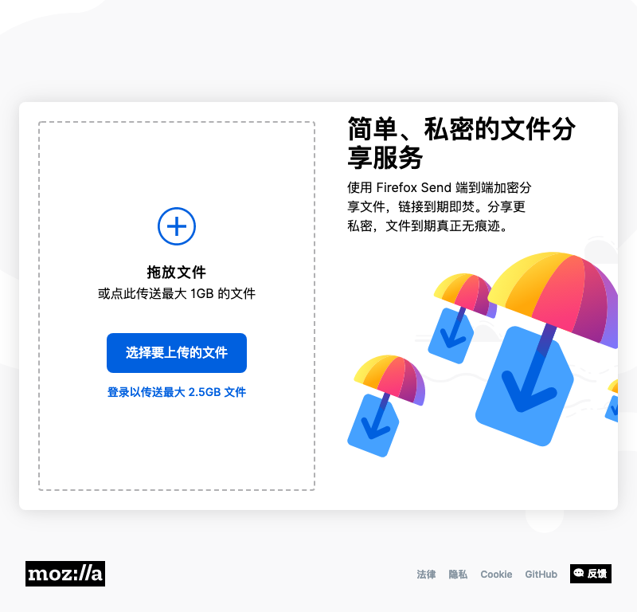

# Firefox Send vNext

## en-US

## ar

## ast

## az

## bs

## ca

## cak

## cs

## cy

## da

## de

## dsb

## el

## es-AR

## es-CL

## es-ES

## es-MX

## et

## fa

## fr

## fy-NL

## hsb

## hu

## ia

## id

## it

## ja

## ka

## kab

## ko

## ms

## nb-NO

## nl

## nn-NO

## pt-BR

## pt-PT

## ro

## ru

## sk

## sl

## sq

## sr

## sv-SE

## te

## tl

## tr

## uk

## vi

## zh-CN

## zh-TW

